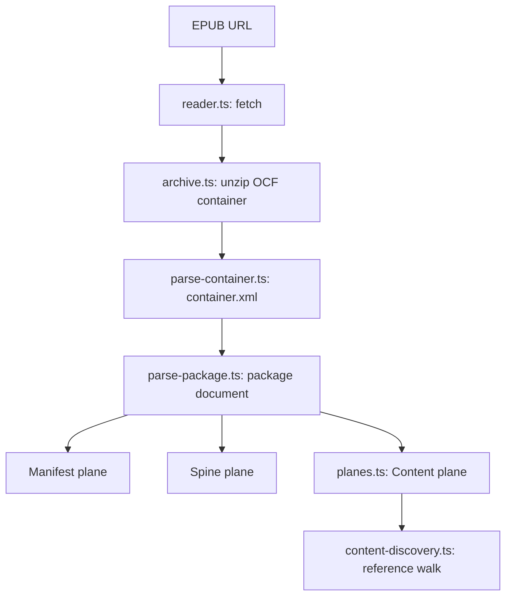

# Architecture

This document describes how lomreader loads an EPUB publication from a URL and produces the three [resource planes](https://www.w3.org/TR/epub-33/#sec-pub-res-intro) defined by EPUB 3.3.

## Loading pipeline

## Step-by-step

### 1. Fetch the OCF ZIP container

**File:** [`src/reader.ts`](../src/reader.ts)

An EPUB file on disk or over HTTP is an [OCF ZIP container](https://www.w3.org/TR/epub-33/#sec-ocf) — a ZIP archive with a required `mimetype` entry and a `META-INF/` directory.

`LomReader.open(url)` uses the platform `fetch` API (or a custom implementation via `ReaderOptions.fetch`) to download the bytes.

### 2. Unzip into an in-memory archive

**File:** [`src/epub/archive.ts`](./epub/archive.md)

The raw bytes are passed to `loadArchive()`, which uses [fflate](https://github.com/101arrowz/fflate) to inflate the ZIP and build a `Map<path, Uint8Array>` of container resources. All subsequent reads go through `readArchiveText()` / `readArchiveBytes()`.

### 3. Locate the package document

**File:** [`src/epub/parse-container.ts`](./epub/parse-container.md)

Every EPUB **must** contain [`META-INF/container.xml`](https://www.w3.org/TR/epub-33/#sec-container-metainf-container.xml). The `rootfile` element's `full-path` attribute points to the [package document](https://www.w3.org/TR/epub-33/#sec-package-doc) (traditionally `content.opf`).

### 4. Parse manifest and spine

**File:** [`src/epub/parse-package.ts`](./epub/parse-package.md)

The package document XML contains:

- **`<metadata>`** — Dublin Core and EPUB metadata, including [`link`](https://www.w3.org/TR/epub-33/#sec-link-elem) elements for linked resources on the manifest plane.
- **`<manifest>`** — [`item`](https://www.w3.org/TR/epub-33/#sec-manifest-elem) elements listing all publication resources.
- **`<spine>`** — [`itemref`](https://www.w3.org/TR/epub-33/#sec-spine-elem) elements defining default reading order.

This produces the **manifest plane** and **spine plane**.

### 5. Build the content plane

**File:** [`src/epub/planes.ts`](./epub/planes.md)

The [content plane](https://www.w3.org/TR/epub-33/#sec-pub-res-intro) contains resources *used when rendering* EPUB content documents — CSS, images, fonts, scripts, etc.

lomreader:

1. Collects EPUB content documents from the spine (plus nav documents and fallback chains).
2. Walks each document's references via [`content-discovery.ts`](./epub/content-discovery.md).
3. Recursively follows CSS `@import` and `url()` references.
4. Classifies each resource using [core media types](https://www.w3.org/TR/epub-33/#sec-core-media-types) from [`constants.ts`](./epub/constants.md).

### 6. Return a `Publication`

**File:** [`src/types.ts`](./types.md)

The `Publication` object exposes:

| Member | Purpose |
|--------|---------|
| `manifest` | Manifest plane |
| `spine` | Spine plane |
| `content` | Content plane |
| `getText(path)` | Read a UTF-8 resource from the archive |
| `getBytes(path)` | Read raw bytes from the archive |
| `resolveHref(href, relativeTo)` | Resolve relative paths per [§3.6](https://www.w3.org/TR/epub-33/#sec-resource-locations) |
| `blobStore` / `getBlobUrl(path)` | Blob URL cache for browser rendering |
| `revokeBlobUrls()` | Release blob URLs on teardown |

## Design principles

- **Spec-first** — file boundaries follow EPUB 3.3 concepts, not arbitrary utility groupings.
- **Pure parsing layer** — `src/epub/` only understands structure; rendering lives in `src/render/`.
- **Browser + Node** — `@xmldom/xmldom` for XML, `fetch` for network, `fflate` for ZIP.
- **Testable stages** — each pipeline step has a dedicated module and unit tests.

## Rendering (v1)

EPUB content documents are displayed via [`ReaderHost`](./rendering.md) — blob URLs, iframe, spine navigation, and hooks for future annotations.

See [rendering.md](./rendering.md) and [futureplans.md](../futureplans.md).

## What is not implemented yet

- Navigation document (TOC) parsing
- Highlighting, overlays, and annotation persistence (designed — see futureplans.md)
- Encryption / obfuscation ([§4.2.6.3.2](https://www.w3.org/TR/epub-33/#sec-container-metainf-encryption.xml))
- Media overlays, fixed layouts, and other specialized EPUB profiles
- Full EPUBCheck-level validation

These will be added incrementally with corresponding docs and tests.
