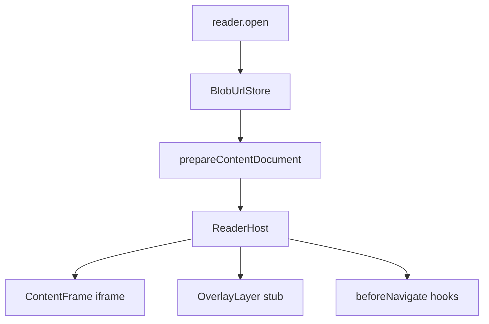

# Rendering (v1)

Browser rendering for EPUB publications using **blob URLs** and a sandboxed **iframe**.

Long-term plans (highlighting, overlays, gated navigation): [futureplans.md](../futureplans.md).

## Pipeline



## API

```ts
import { createReader, createReaderHost } from 'lomreader';

const publication = await createReader().open('http://localhost:3001/epubs/hypatia.epub');
const host = await createReaderHost(publication, { container: document.getElementById('reader')! });

host.on('chapterchange', (event) => {
  console.log(event.detail.path);
});

host.beforeNavigate(async (ctx) => {
  // Future: save highlights before page turn
});

await host.next();
await host.prev();

host.getOverlayElement(); // empty div above iframe for future annotations
host.destroy();
```

## How blob URLs solve relative paths

EPUB chapters reference CSS/images with relative hrefs. A naive `iframe.src = blob:...` breaks those references.

`prepareContentDocument()`:

1. Loads chapter XHTML from the archive
2. Rewrites `link`, `script`, `img`, etc. to blob URLs via `BlobUrlStore`
3. Recursively prepares linked CSS (`url()`, `@import`)
4. Returns a blob URL for the prepared chapter

## ReaderHost shell

v1 uses a **ReaderHost** wrapper (not a bare iframe) so future features attach without rework:

| Piece | v1 | Future |
|-------|-----|--------|
| `ContentFrame` | one iframe | N slots for spreads |
| `OverlayLayer` | empty div | highlights, draw, comments |
| `beforeNavigate` | async hook stub | save annotations before turn |
| Events | `chapterchange`, `navigate` | postMessage from iframe |

## Spec references

- [EPUB content documents (§3.1.2)](https://www.w3.org/TR/epub-33/#sec-pub-res-intro)
- [Resource locations (§3.6)](https://www.w3.org/TR/epub-33/#sec-resource-locations)

## Modules

| File | Role |
|------|------|
| [`src/render/blob-store.ts`](../src/render/blob-store.ts) | Path → blob URL cache |
| [`src/render/prepare-document.ts`](../src/render/prepare-document.ts) | Rewrite refs for iframe |
| [`src/render/content-frame.ts`](../src/render/content-frame.ts) | iframe adapter |
| [`src/render/reader-host.ts`](../src/render/reader-host.ts) | Layout shell, events, navigation |
