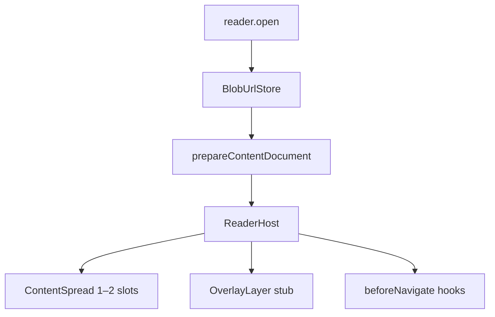

# Rendering

Browser rendering for EPUB publications using **blob URLs** and sandboxed **iframe(s)**.

Long-term plans (highlighting, overlays, gated navigation): [futureplans.md](../futureplans.md).

## Pipeline



## API

```ts
import { createReader, createReaderHost } from 'lomreader';

const publication = await createReader().open('http://localhost:3001/epubs/hypatia.epub');
const host = await createReaderHost(publication, {
  container: document.getElementById('reader')!,
  layout: '2-up', // or '1-up' (default)
});

host.on('spreadchange', (event) => {
  console.log(event.detail.slots.map((slot) => slot.path));
});

host.on('chapterchange', (event) => {
  console.log(event.detail.path); // primary (left) page
});

await host.setLayout('2-up'); // switch at runtime
await host.next(); // advances 2 linear items in 2-up mode
await host.prev();

host.getVisibleSpineIndices(); // spine indices currently on screen
host.getContentFrameElements(); // one or two iframes
host.destroy();
```

## Layout modes

| Mode | Slots | Navigation step |
|------|-------|-----------------|
| `1-up` | one iframe, one spine item | +1 linear item |
| `2-up` | two iframes side-by-side | +2 linear items |

In **2-up** mode, the reader shows adjacent linear XHTML spine items as a spread. If the book ends on an odd linear count, the last spread shows only the left page.

`showSpineIndex(n)` aligns the spread so item `n` is visible (left page, or right page of the pair containing `n`).

## Events

| Event | When | Detail |
|-------|------|--------|
| `chapterchange` | After load | Primary (left / single) slot — backward compatible |
| `spreadchange` | After load | All visible slots + layout |
| `navigate` | Before iframe swap | From/to paths and layout |

## How blob URLs solve relative paths

EPUB chapters reference CSS/images with relative hrefs. A naive `iframe.src = blob:...` breaks those references.

`prepareContentDocument()`:

1. Loads chapter XHTML from the archive
2. Rewrites `link`, `script`, `img`, etc. to blob URLs via `BlobUrlStore`
3. Recursively prepares linked CSS (`url()`, `@import`)
4. Returns a blob URL for the prepared chapter

## ReaderHost shell

`ReaderHost` owns layout, events, and navigation. `ContentSpread` manages 1–2 `ContentFrame` iframes:

| Piece | Status |
|-------|--------|
| `ContentSpread` | 1-up / 2-up iframe slots |
| `OverlayLayer` | empty div (future highlights) |
| `beforeNavigate` | async hook pipeline |
| Events | `chapterchange`, `spreadchange`, `navigate` |

## Spec references

- [EPUB content documents (§3.1.2)](https://www.w3.org/TR/epub-33/#sec-pub-res-intro)
- [Resource locations (§3.6)](https://www.w3.org/TR/epub-33/#sec-resource-locations)

## Modules

| File | Role |
|------|------|
| [`src/render/blob-store.ts`](../src/render/blob-store.ts) | Path → blob URL cache |
| [`src/render/prepare-document.ts`](../src/render/prepare-document.ts) | Rewrite refs for iframe |
| [`src/render/content-frame.ts`](../src/render/content-frame.ts) | Single iframe adapter |
| [`src/render/spread-layout.ts`](../src/render/spread-layout.ts) | 1-up / 2-up spread container |
| [`src/render/reader-host.ts`](../src/render/reader-host.ts) | Layout shell, events, navigation |
