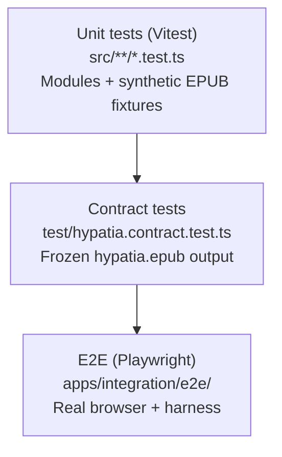

# Testing guide

lomreader uses a three-layer test strategy to protect backwards compatibility as the library grows.

## Test pyramid



## Unit tests (Vitest)

**Location:** `packages/lomreader/src/**/*.test.ts`, `packages/lomreader/test/**/*.test.ts`

**Run:**

```bash
yarn workspace lomreader test
yarn workspace lomreader test:watch
yarn workspace lomreader test:coverage
```

Each `src/epub/` module has dedicated tests. Synthetic EPUBs are built in [`test/fixtures/build-epub.ts`](../test/fixtures/build-epub.ts) — no binary fixtures committed except via the shared `hypatia.epub` in the epub-server.

| Test file | Module covered |
|-----------|----------------|
| `archive.test.ts` | ZIP inflation, read helpers |
| `paths.test.ts` | Path normalization and resolution |
| `xml.test.ts` | XML parsing utilities |
| `parse-container.test.ts` | container.xml |
| `parse-package.test.ts` | OPF manifest/spine |
| `content-discovery.test.ts` | Reference extraction, classification |
| `planes.test.ts` | Content plane assembly |
| `reader.test.ts` | Public API |

## Contract tests

**Location:** [`test/hypatia.contract.test.ts`](../test/hypatia.contract.test.ts)

Uses the real [`hypatia.epub`](../../../apps/epub-server/public/epubs/hypatia.epub) Standard Ebooks fixture. Counts and identifiers are **frozen** — if a parser change alters these values, the test fails.

**When to update contract tests:**

- Intentional spec-correctness fixes (document in PR)
- Never for accidental regressions — fix the code instead

## Integration / E2E tests (Playwright)

**Location:** `apps/integration/`

| File | Purpose |
|------|---------|
| `src/harness.ts` | Browser app that calls `reader.open()` against live epub-server |
| `e2e/reader.spec.ts` | Asserts DOM output matches expected plane data |
| `e2e/api.spec.ts` | Direct fetch + reader.open in Node-like browser context |

**Run:**

```bash
yarn workspace @lomreader/integration test:install-browsers  # once — required before first run
yarn test:integration
yarn test:all  # unit + e2e
```

Playwright downloads Chromium on first install (~180 MB). Integration/e2e tests and the pre-commit hook (`yarn precommit`) will fail without it.

## Adding tests for a new feature

1. **Unit** — test the module in isolation with minimal fixtures.
2. **Contract** — if behaviour affects `hypatia.epub` output, expect intentional updates.
3. **Harness** — add `data-testid` attributes for observable behaviour.
4. **E2E** — add Playwright spec asserting user-visible results.

### Pre-commit hook (local)

Husky runs `yarn precommit` before each commit (lint → typecheck → unit → e2e). See [CONTRIBUTING.md](../../../CONTRIBUTING.md).
