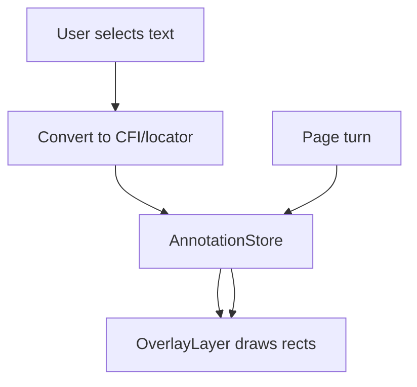

# Future plans — lomreader rendering & interaction

Long-term design notes for features **not yet implemented**. v1 rendering (`ReaderHost`, blob URLs, iframe) is built to align with these plans.

See also: [docs/rendering.md](docs/rendering.md) for current v1 behaviour.

---

## Highlighting

### Problem

Highlights stored **inside iframe DOM** are destroyed on page turn (new blob `src`). With two-page spreads, each visible page may be a different document or paginated slice — DOM state does not travel.

### Approach

1. **AnnotationStore** (host app) — persist highlights keyed by stable **locators**:
   - [EPUB CFI](https://idpf.org/epub/link/cfi/) (preferred)
   - Fallback: `{ spineIndex, path, startOffset, endOffset, textQuote }`
2. **OverlayLayer** — host-owned SVG/canvas/div **above** iframe(s), not injected into EPUB XHTML
3. On navigation: save pending selection → load new content → **re-apply** overlays from store



### Do not

- Persist `<mark>` tags inside chapter XHTML served to iframe
- Store highlight state only on iframe `contentDocument`

---

## Two-page spread (1-up / 2-up)

- **ReaderHost** owns layout mode, not `ContentFrame`
- v1: one iframe, one spine item
- Future: **N content slots** (1–2 iframes or paginated slices of same chapter)
- Single **AnnotationStore** + **OverlayLayer** mapped across all slots via locators

---

## Event bus

### v1 (implemented)

- `ReaderHost` extends / wraps `EventTarget`
- Events: `chapterchange`, `navigate`, `error`

### Future

- **postMessage bridge** iframe → host for in-content clicks, links, form controls
- Normalize host chrome events (next, highlight mode) on same bus
- Typed event map (`ReaderHostEventMap`)

---

## Overlay layer (paint, comments, tools)

- Absolute positioned layer above content stack (`getOverlayElement()` in v1)
- Modes: read (pointer-events none on overlay) / highlight / draw / comment
- Comment pins anchored to locators; editor UI in host DOM
- Tools that modify EPUB **content** (rare) vs **annotations** (common) — prefer annotations

---

## Action pipeline (gated navigation)

Before any navigation (`next`, `prev`, `goToSpineIndex`):

```ts
readerHost.beforeNavigate(async (ctx) => {
  await savePendingHighlights(ctx.from);
  await flushCommentQueue();
  // throw to cancel navigation
});
```

- Hooks run **sequentially**, awaited before iframe swap
- v1: stub pipeline exists; hooks are no-op by default
- Future: timeout, retry, user confirmation step

---

## Persistence

- AnnotationStore interface → REST / IndexedDB / user sync
- Pipeline hooks call persistence adapters
- Offline-first: queue writes, flush on `beforeNavigate`

---

## Service Worker alternative

If blob URL rewriting becomes insufficient (complex CSS, fonts, SVG `use`):

- Register SW with virtual path prefix per publication ID
- iframe `src` = `/epub-reader/{id}/path/to/chapter.xhtml`
- SW serves bytes from in-memory archive
- Relative URLs work natively; overlay/locator model unchanged

---

## Open questions

- Pagination within one XHTML chapter (CSS columns vs explicit page map)?
- SVG spine items (e.g. titlepage) — separate slot or skip in linear nav?
- EPUB 3 media overlays / read-aloud sync with locators?
- Accessibility: ensure overlay highlights expose to AT (ARIA mirroring)
